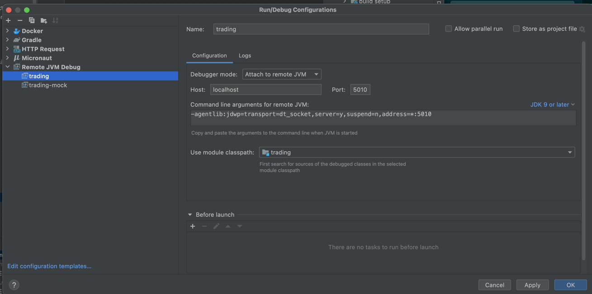
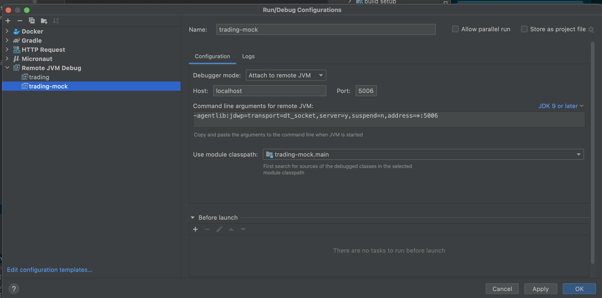

# dev-environments-workshop
Workshop for experiencing and comparing various different approaches to creating local development environments.

## TILT
Tilt is a tool much like Docker Compose which is intended to help you work with Kubernetes as your primary driver for
local or remote development.

To get started, make sure that you have a local k8s cluster running. Most likely easiest with this tooling.
https://github.com/tilt-dev/ctlptl#docker-for-mac-enable-kubernetes-and-set-4-cpu or KIND.

Then, install Tilt: https://docs.tilt.dev/install.html and run `tilt up` in the root of this repository.

You should be good to go.

## Remote debugging
Since the application running in a remote runtime, you will have to use a remote debugger to be able to work efficiently. 
You can achieve this with the following configuration:

